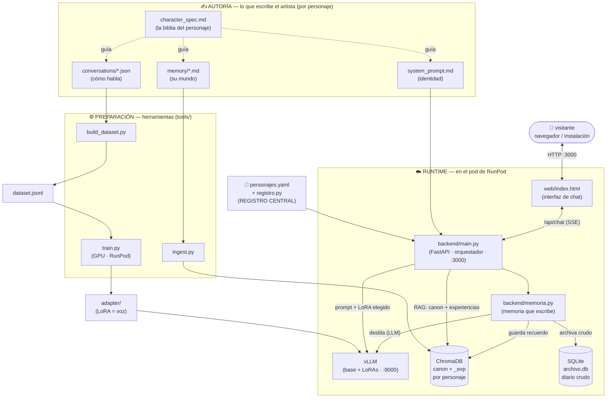

# Arquitectura de componentes

Diagrama de las partes de la plataforma: qué escribe el artista, qué las
transforma (preparación/entrenamiento) y qué corre en vivo (runtime).

## Cómo leerlo

- **Flechas punteadas** = relación de diseño (el spec guía lo demás).
- **Flechas sólidas de PREP** = pipeline que se corre **una vez** por personaje
  (offline): las conversaciones se vuelven voz (LoRA), la memoria se indexa.
- **Flechas del RUNTIME** = lo que ocurre **en cada conversación**, en vivo.

## Las tres zonas

| Zona | Cuándo ocurre | Necesita GPU |
|------|---------------|--------------|
| **Autoría** | Al crear el personaje (escribes) | No |
| **Preparación** | Una vez por personaje | Solo `train.py` |
| **Runtime** | En cada visita, en vivo | Sí (vLLM) |

## El registro como centro

`personajes.yaml` es el eje: le dice al backend, por cada personaje, **qué LoRA
usar** (voz), **qué colección consultar** (memoria), **qué system prompt cargar**
(identidad). Añadir un personaje = una entrada aquí + su carpeta. Nada más cambia.

## El flujo de una conversación (runtime), en orden

1. El visitante escribe en la **web**.
2. El **backend** mira el registro: qué personaje, qué LoRA, qué colección.
3. Consulta **ChromaDB** (canon + experiencias) → contexto relevante.
4. Arma el prompt (identidad + contexto + mensaje) y llama a **vLLM** con el LoRA
   de ese personaje.
5. vLLM responde en streaming; el backend lo reenvía a la web.
6. Al terminar, **memoria.py** (en segundo plano): archiva el intercambio en
   **SQLite**, lo destila con vLLM y guarda el recuerdo en **ChromaDB**.
